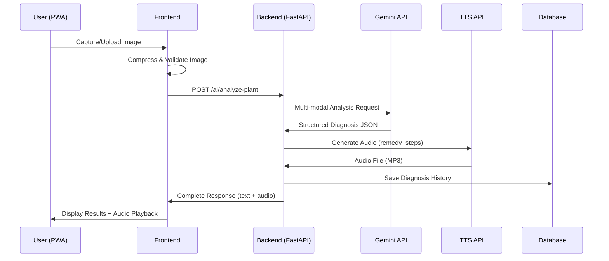

# AI Plant Diagnosis Design Document

## Overview

The AI Plant Diagnosis feature implements a multi-modal AI pipeline that processes plant images through Google's Gemini 1.5 API for disease identification and generates audio responses using Google Cloud Text-to-Speech. The system is designed to work efficiently in low-bandwidth environments while providing accurate, accessible agricultural guidance to farmers.

## Architecture

### High-Level Flow



### Component Architecture

The feature spans three main architectural layers:

1. **Frontend (PWA)**: Image capture, compression, UI, and audio playback
2. **Backend (AI Gateway)**: API orchestration, prompt engineering, and data persistence
3. **External Services**: Gemini API for analysis, TTS API for audio generation

## Components and Interfaces

### Frontend Components

#### ImageCaptureComponent
- **Purpose**: Handle image capture from camera or file upload
- **Key Methods**:
  - `captureFromCamera()`: Access device camera using MediaDevices API
  - `uploadFromFile()`: Handle file input with drag-and-drop support
  - `compressImage(file, quality)`: Client-side compression using Canvas API
  - `validateImage(file)`: Check format, size, and basic image validity

#### DiagnosisDisplayComponent
- **Purpose**: Show analysis results with text and audio playback
- **Key Methods**:
  - `renderDiagnosis(data)`: Display structured diagnosis information
  - `playAudio(audioData)`: Handle audio playback with controls
  - `saveToHistory()`: Store diagnosis in local storage for offline access

#### HistoryComponent
- **Purpose**: Display and manage diagnosis history
- **Key Methods**:
  - `loadHistory()`: Fetch user's diagnosis history from backend
  - `renderHistoryItem(diagnosis)`: Display individual diagnosis with thumbnail
  - `deleteHistoryItem(id)`: Remove diagnosis from history

### Backend Components

#### AIGatewayService
- **Purpose**: Orchestrate AI API calls and handle responses
- **Key Methods**:
  - `analyzePlantImage(imageData, userLanguage)`: Main analysis pipeline
  - `callGeminiAPI(imageBase64, prompt)`: Handle Gemini API communication
  - `generateAudio(text, language)`: Convert text to speech
  - `handleAPIErrors(error)`: Implement retry logic and error handling

#### PromptEngineering
- **Purpose**: Manage AI prompts for consistent, accurate responses
- **Key Methods**:
  - `buildDiagnosisPrompt(language)`: Create structured prompt for Gemini
  - `validateResponse(response)`: Ensure response matches expected JSON schema
  - `sanitizeOutput(text)`: Clean and format AI responses for safety

#### DiagnosisRepository
- **Purpose**: Handle data persistence for diagnosis history
- **Key Methods**:
  - `saveDiagnosis(userId, diagnosis, imageData)`: Store complete diagnosis
  - `getUserHistory(userId, limit)`: Retrieve user's diagnosis history
  - `cleanupOldDiagnoses(userId)`: Implement retention policy

## Data Models

### DiagnosisRequest
```typescript
interface DiagnosisRequest {
  imageData: string;        // Base64 encoded image
  imageFormat: string;      // 'jpeg' | 'png' | 'webp'
  userLanguage: string;     // ISO language code
  userId: string;           // User identifier
  timestamp: Date;
}
```

### DiagnosisResponse
```typescript
interface DiagnosisResponse {
  id: string;
  diseaseIdentified: boolean;
  diagnosis: {
    disease_name: string;
    cause_explanation: string;
    remedy_steps: string[];
    confidence_level: number;
  };
  audioData?: string;       // Base64 encoded MP3
  audioUrl?: string;        // Temporary URL for audio playback
  disclaimer: string;
  timestamp: Date;
  processingTimeMs: number;
}
```

### HistoryItem
```typescript
interface HistoryItem {
  id: string;
  userId: string;
  thumbnail: string;        // Compressed image for display
  diagnosis: DiagnosisResponse;
  createdAt: Date;
}
```

## Error Handling

### Frontend Error Handling
- **Image Validation Errors**: Clear user feedback for unsupported formats or oversized files
- **Network Errors**: Retry mechanisms with exponential backoff
- **Camera Access Errors**: Fallback to file upload with helpful error messages
- **Audio Playback Errors**: Graceful degradation to text-only display

### Backend Error Handling
- **API Rate Limiting**: Implement circuit breaker pattern for external APIs
- **Gemini API Errors**: Fallback responses with general plant care advice
- **TTS API Errors**: Continue with text-only response, log for retry
- **Database Errors**: Ensure diagnosis still returns to user, log for later persistence

### Error Response Schema
```typescript
interface ErrorResponse {
  error: true;
  errorCode: string;
  message: string;
  fallbackAdvice?: string;
  retryable: boolean;
  retryAfterMs?: number;
}
```

## Testing Strategy

### Unit Testing
- **Frontend**: Test image compression, validation, and UI component rendering
- **Backend**: Test prompt generation, API response parsing, and data persistence
- **Mocking**: Mock external API responses for consistent testing

### Integration Testing
- **API Pipeline**: End-to-end testing of image upload to final response
- **Error Scenarios**: Test various failure modes and recovery mechanisms
- **Performance**: Test with different image sizes and network conditions

### User Acceptance Testing
- **Real Device Testing**: Test camera functionality across different mobile devices
- **Language Testing**: Verify TTS quality across supported languages
- **Accessibility Testing**: Ensure audio controls work with screen readers

## Performance Considerations

### Image Processing
- **Client-side Compression**: Reduce bandwidth usage while maintaining diagnostic quality
- **Progressive Loading**: Show immediate feedback while processing
- **Caching Strategy**: Cache compressed images locally for history feature

### API Optimization
- **Request Batching**: Group multiple requests when possible
- **Response Caching**: Cache common diagnoses to reduce API calls
- **Timeout Management**: Implement appropriate timeouts for different network conditions

### Audio Handling
- **Streaming**: Stream audio as it's generated for faster perceived performance
- **Compression**: Use appropriate audio compression for mobile bandwidth
- **Preloading**: Preload common audio responses for offline scenarios

## Security Considerations

### Data Privacy
- **Image Handling**: Ensure images are not stored permanently on external services
- **User Data**: Encrypt sensitive user information in database
- **API Keys**: Secure storage and rotation of external API credentials

### Input Validation
- **Image Sanitization**: Validate and sanitize uploaded images
- **Prompt Injection**: Prevent malicious prompts from being sent to AI APIs
- **Rate Limiting**: Implement user-level rate limiting to prevent abuse

### Content Safety
- **AI Response Filtering**: Validate AI responses for harmful or inappropriate content
- **Disclaimer Requirements**: Ensure all diagnoses include appropriate medical/agricultural disclaimers
- **Professional Consultation**: Emphasize limitations and need for expert consultation